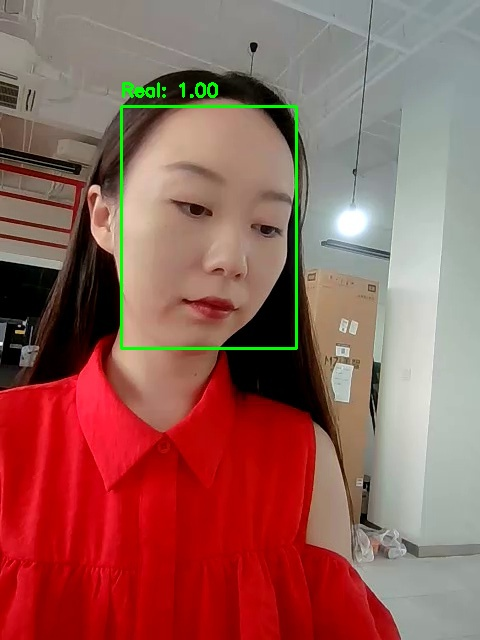
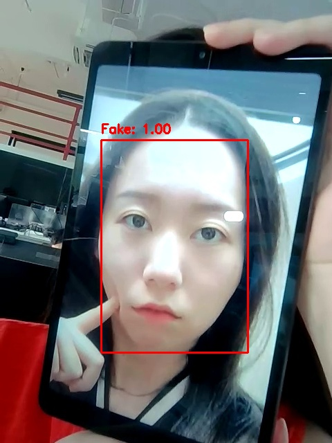

# Face Anti-Spoofing

[](https://github.com/yakhyo/face-anti-spoofing/releases)
[](https://github.com/yakhyo/face-anti-spoofing/stargazers)

Minimal inference utilities for silent face anti-spoofing using **MiniFASNetV1SE** and **MiniFASNetV2** models.

|             Real              |             Fake              |             Fake              |
| :---------------------------: | :---------------------------: | :---------------------------: |
|  |  |  |

## Installation

```bash
pip install -r requirements.txt
```

## Usage

### Image Inference

```bash
python main.py --source assets/image.jpg --weight weights/MiniFASNetV2.pth --output result.jpg --view
```

### Webcam Inference

```bash
python main.py --source 0 --weight weights/MiniFASNetV2.pth --view
```

### Options

| Argument       | Default | Description                          |
| -------------- | ------- | ------------------------------------ |
| `--weight`     | -       | Path to model weights (.pth)         |
| `--model`      | `v2`    | Model variant (`v1se` or `v2`)       |
| `--source`     | `0`     | Image path or camera index           |
| `--output`     | -       | Path to save output (image or video) |
| `--view`       | -       | Display inference results            |
| `--confidence` | `0.5`   | Face detection confidence threshold  |

## ONNX Export

```bash
python onnx_export.py --weight weights/MiniFASNetV2.pth --model v2 --dynamic
```

## ONNX Inference

```bash
python onnx_inference.py --model weights/MiniFASNetV2.onnx --scale 2.7
```

## Model Weights

| Model          | Parameters | Crop Scale | Download                                                                                                                                                                                                   |
| -------------- | ---------- | ---------- | ---------------------------------------------------------------------------------------------------------------------------------------------------------------------------------------------------------- |
| MiniFASNetV1SE | ~0.43M     | 4.0        | [PyTorch](https://github.com/yakhyo/face-anti-spoofing/releases/download/weights/MiniFASNetV1SE.pth) \| [ONNX](https://github.com/yakhyo/face-anti-spoofing/releases/download/weights/MiniFASNetV1SE.onnx) |
| MiniFASNetV2   | ~0.43M     | 2.7        | [PyTorch](https://github.com/yakhyo/face-anti-spoofing/releases/download/weights/MiniFASNetV2.pth) \| [ONNX](https://github.com/yakhyo/face-anti-spoofing/releases/download/weights/MiniFASNetV2.onnx)     |

## Reference

Based on [Silent-Face-Anti-Spoofing](https://github.com/minivision-ai/Silent-Face-Anti-Spoofing)
